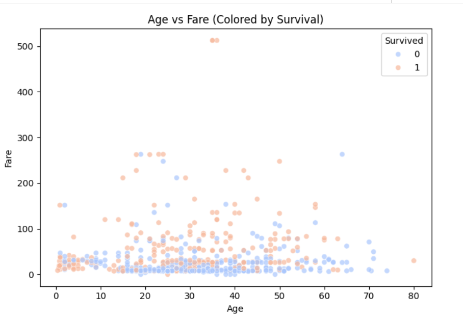
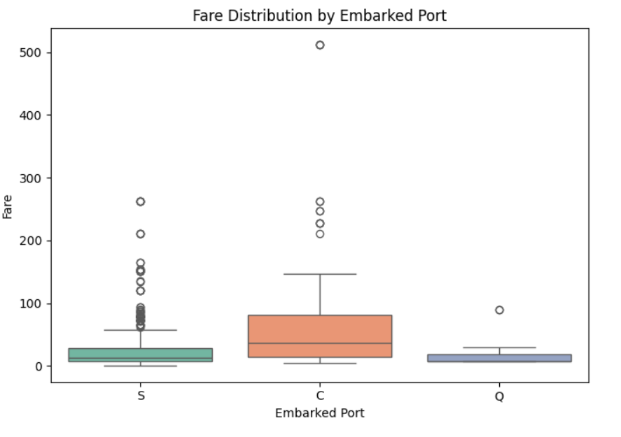
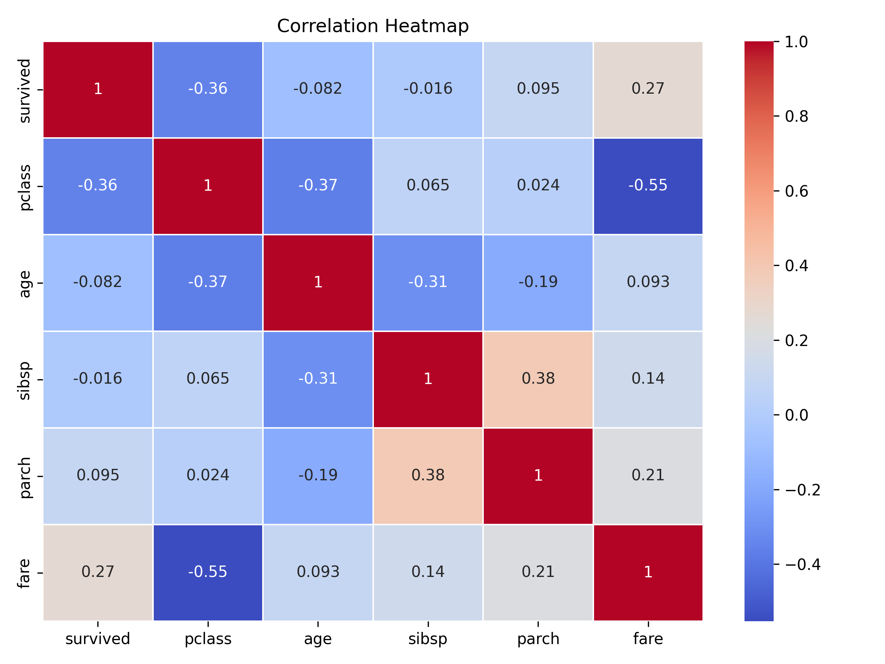
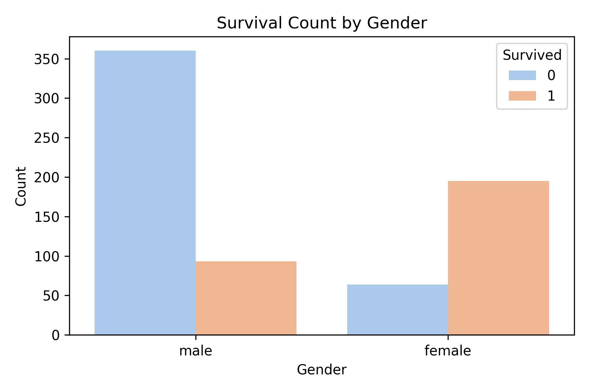

# Titanic-data-visualization
“Enhanced data visualization project using Titanic dataset (Seaborn &amp; Matplotlib).”

# Titanic Data Visualization Project – Enhanced Version

## 📌 Overview
This project visualizes the Titanic dataset using **Seaborn** and **Matplotlib**.  
It demonstrates essential plots for data exploration: bar charts, scatter plots, boxplots, heatmaps, and additional survival analysis by gender.

---

## 🛠 Tools & Libraries
| Purpose            | Library     |
|--------------------|-------------|
| Data manipulation  | pandas      |
| Plotting           | matplotlib  |
| Advanced graphics  | seaborn     |

---

## 📊 Visualizations
- **Passenger Count by Class** (bar chart)  
- **Age vs Fare Colored by Survival** (scatter plot)  
- **Fare Distribution by Embarked Port** (boxplot)  
- **Correlation Heatmap** (heatmap)  
- **Survival Count by Gender** (bar chart)

### Sample Outputs

  
  
  
  


---

## ▶ Usage
1. Clone the repo:  
   ```bash
   git clone https://github.com/<your-username>/titanic-data-visualization.git

